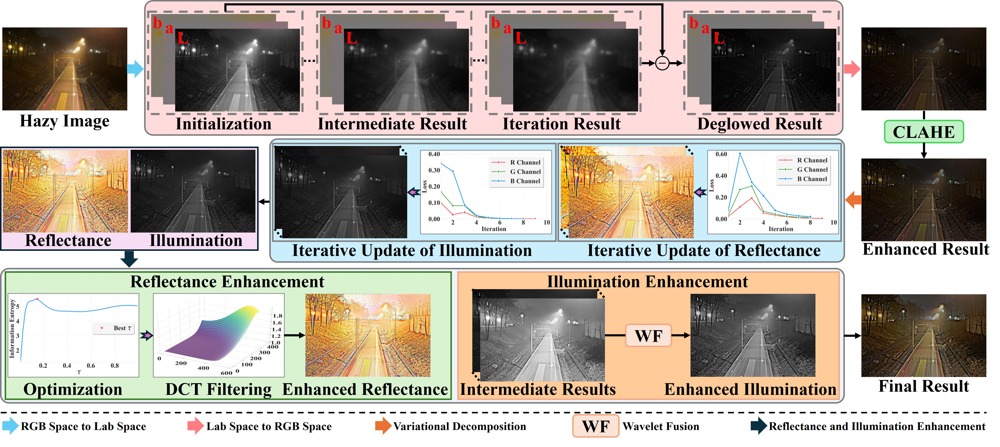

# Real-World Nighttime Image Dehazing via Bayesian-Based Fractional-Order Variational Model

This repository contains the implementation of our paper: **"Real-World Nighttime Image Dehazing via Bayesian-Based Fractional-Order Variational Model"**.

### **Authors**
**Yun Liu<sup>1</sup>, Tao Li<sup>1</sup>, Zichen Zhou<sup>2</sup>, Wenqi Ren<sup>3</sup>, Weisi Lin<sup>4</sup>**
1. *College of Artificial Intelligence, Southwest University, Chongqing, China*
2. *China University of Petroleum, China*
3. *School of Cyber Science and Technology, Sun Yat-sen University, Shenzhen, China*
4. *College of Computing and Data Science, Nanyang Technological University (NTU), Singapore*

---


## **Methodology**

### **Overall Flowchart**
The following flowchart illustrates the proposed method for nighttime image dehazing:

<p align="center">
  
</p>


---

## **Installation & Usage**

### **Prerequisites**
- MATLAB (Tested on R2021a or later)

### **Run the Demo**
1. Place your hazy nighttime images in the `input/` folder.
2. Run the `demo.m` script:
   ```matlab
   demo
   ```
3. The processed images will be saved in the `output/` folder.

---

## **Citation**
If you find this work useful for your research, please cite our paper:
```bibtex
@article{Liu2026RealWorldNighttime,
  title={Real-World Nighttime Image Dehazing via Bayesian-Based Fractional-Order Variational Model},
  author={Liu, Yun and Li, Tao and Zhou, Zichen and Ren, Wenqi and Lin, Weisi},
  journal={},
  year={2026}
}

